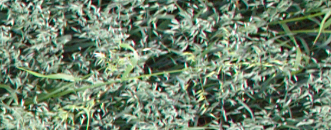
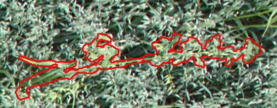

A Python script which detects common wild oats from aerial images of oat fields.
The algorithm is based on region growing which adds neighbour pixels
to the growing region until a membership criterion is satisfied.

The membership criterion applied minimizes the width of the region and maximizes its intensity.
It guides the growing process to advance along the culm of a plant and makes
it possible to classify the plants into different species according to their length.

Before growing, the images are preprocessed with PCA and the color difference of weeds and background is emphasized.

An example of a common wild oat and a segmented region including the plant: 

